# MARLCO: Multi-Agent Reinforcement Learning Cooperation Platform

[中文文档](./README_CN.md) | English


## 📌 Overview

**MARLCO** (Multi-Agent Reinforcement Learning Cooperation) is a comprehensive experimental platform for multi-agent reinforcement learning (MARL), integrating diverse environments and state-of-the-art algorithms. This platform is designed for researchers and practitioners to conduct experiments, benchmark algorithms, and develop new MARL solutions.

### Key Features

✅ **6 MARL Algorithms**: QMIX, VDN, IQL, COMA, MADDPG, MAPPO  
✅ **5 Custom Environments**: CM, DEM, HRG, MSFS, SMAC wrapper  
✅ **CTDE Framework**: Centralized Training with Decentralized Execution  
✅ **Unified Interface**: Consistent APIs across all environments and algorithms  
✅ **Comprehensive Analysis**: Built-in tools for result visualization and comparison  
✅ **Easy Configuration**: YAML-based configuration for quick experimentation  

---

## 📂 Project Structure

```
marlco/
├── Env/                      # Multi-agent environments
│   ├── CM/                   # Collaborative Moving
│   ├── DEM/                  # Dynamic Escort Mission
│   ├── HRG/                  # Heterogeneous Resource Gathering
│   ├── MSFS/                 # Smart Manufacturing Flow Scheduling
│   └── SMAC/                 # StarCraft Multi-Agent Challenge wrapper
│
├── qmix/                     # QMIX algorithm implementation
├── vdn/                      # VDN algorithm implementation
├── iql/                      # IQL algorithm implementation
├── coma/                     # COMA algorithm implementation
├── maddpg/                   # MADDPG algorithm implementation
├── mappo/                    # MAPPO algorithm implementation
│
└── analysis/                 # Analysis and visualization tools
    ├── data_loader.py        # Training data loader
    ├── metrics_analyzer.py   # Metrics analysis
    └── plot_generator.py     # Plot generation
```

---

## 🚀 Quick Start

### 1. Installation

```bash
# Clone the repository
git clone https://github.com/yourusername/marlco.git
cd marlco

# Install dependencies
pip install -r Env/doc/requirements.txt

# Optional: For SMAC environment
pip install -r Env/doc/requirements_with_smac.txt
```

### 2. Run a Training Experiment

```bash
# Train QMIX on CM environment (recommended: use config file)
cd qmix
python main.py --config config_simple_spread.yaml --plots --plot-dir simplespreadplots

# Train MADDPG on DEM environment
cd maddpg
python main.py --config config_DEM_normal.yaml --plots

# Train MAPPO on HRG environment (recommended: use ultra_fast for time-saving)
cd mappo
python main.py --config config_HRG_ultrafast.yaml --plots
```

### 3. Analyze Results

```bash
# Analyze training results
cd analysis
python corrected_analyze_results.py

# Check output in corrected_output directory
cat corrected_output/corrected_analysis_summary.txt
```

---

## 🌍 Environments

### 1. **CM (Collaborative Moving)**

Agents cooperatively push a box to a target location. Success probability increases with the number of cooperating agents.

- **Agents**: 2-4
- **Difficulty Levels**: debug, easy, normal, hard
- **Key Challenge**: Coordination and timing
- **Note**: ⚠️ Challenging environment, requires careful tuning

### 2. **DEM (Dynamic Escort Mission)**

Special forces agents escort a VIP through dangerous territory, dynamically forming roles (Guard, Vanguard, Sniper).

- **Agents**: 3
- **Difficulty Levels**: easy, normal, hard
- **Key Challenge**: Role formation and threat management

### 3. **HRG (Heterogeneous Resource Gathering)**

Heterogeneous agents (Scouts, Workers, Transporters) collect resources and return them to base.

- **Agents**: 2-6
- **Difficulty Levels**: easy, normal, hard, ultra_fast
- **Key Challenge**: Role-based cooperation
- **Note**: ⚠️ Challenging environment, **recommend using `ultra_fast` for time-saving**

### 4. **MSFS (Smart Manufacturing Flow Scheduling)**

Robots process orders through a 3-stage manufacturing pipeline, naturally forming specialized roles.

- **Agents**: 1-3
- **Difficulty Levels**: easy, normal, hard
- **Key Challenge**: Pipeline optimization and role emergence
- **Note**: ✅ **Basic environment, good for testing algorithm convergence**

### 5. **SMAC (StarCraft Multi-Agent Challenge)**

Wrapper for the official SMAC environment, supporting various StarCraft II combat scenarios.

- **Maps**: 3m, 8m, 2s3z, MMM, corridor, etc.
- **Key Challenge**: Combat coordination and unit control

### 6. **PettingZoo Environments**

All algorithms also support three PettingZoo cooperative environments:

- **multiwalker**: Multiple bipedal walkers carrying a package
- **simple_crypto**: Encrypted communication task
- **simple_spread**: Landmark coverage task

📖 **Detailed Environment Documentation**: See [Env/README.md](./Env/README.md)

---

## 🧠 Algorithms

### Value-Based Methods

| Algorithm | Type | Key Feature | Best For |
|-----------|------|-------------|----------|
| **QMIX** | Value Decomposition | Monotonic value mixing | Cooperative tasks |
| **VDN** | Value Decomposition | Linear value decomposition | Simple coordination |
| **IQL** | Independent Learning | Fully decentralized | Baseline comparison |

### Policy Gradient Methods

| Algorithm | Type | Key Feature | Best For |
|-----------|------|-------------|----------|
| **COMA** | Actor-Critic | Counterfactual baseline | Credit assignment |
| **MADDPG** | Actor-Critic | Centralized critic | Mixed-motive tasks |
| **MAPPO** | PPO-based | Stable training | Long-horizon tasks |

📖 **Detailed Algorithm Documentation**: See individual algorithm folders

---

## ⚙️ Configuration

Each algorithm folder contains multiple configuration files:

```yaml
# config.yaml (example)
env:
  name: "CM"                    # Environment name
  difficulty: "hard"            # Difficulty level
  global_state_type: "concat"   # Global state type

algorithm:
  gamma: 0.99                   # Discount factor
  learning_rate: 0.001          # Learning rate
  tau: 0.005                    # Target network update rate

training:
  total_episodes: 5000          # Total training episodes
  batch_size: 64                # Batch size
  buffer_size: 100              # Replay buffer size (×1000)
  eval_interval: 100            # Evaluation interval
```

**Pre-configured Files**:
- `config_CM_hard.yaml` - CM environment (hard)
- `config_DEM_normal.yaml` - DEM environment (normal)
- `config_HRG_ultrafast.yaml` - HRG environment (ultra-fast)
- `config_MSFS_hard.yaml` - MSFS environment (hard)
- And more...

---

## 📊 Training and Evaluation

### Training Process

1. **Environment Setup**: Initialize environment with specified difficulty
2. **Experience Collection**: Agents interact with the environment
3. **Network Update**: Update networks based on collected experiences
4. **Evaluation**: Periodically evaluate performance without exploration
5. **Checkpointing**: Save models and training data

### Monitoring

Training progress is displayed in real-time:

```
Episode 100/5000 | Reward: 45.23 | Epsilon: 0.25 | Loss: 0.342
Episode 200/5000 | Reward: 52.18 | Epsilon: 0.22 | Loss: 0.289
...
```

### Output Files

- **Checkpoints**: `checkpoints/algo_episode_*.pt`
- **Training Data**: `checkpoints/env_difficulty_training_data_*.json`
- **Plots**: `plots/env_difficulty_*.png`

---

## 📈 Analysis Tools

### Data Loader

```python
from analysis.data_loader import TrainingDataLoader, compute_statistics

loader = TrainingDataLoader()
rewards = loader.load_algorithm_environment_data("QMIX", "CM_hard")
stats = compute_statistics(rewards)
```

### Metrics Analyzer

- Episode rewards
- Episode lengths
- Training loss
- Exploration decay
- Performance trends

### Plot Generator

Generate publication-quality plots:
- Reward curves with confidence intervals
- Learning curves comparison
- Performance distribution
- Training summary dashboard

---

## 🔬 Benchmark Experiments

### Single Algorithm Training

```bash
# Recommended: Use config files
cd qmix
python main.py --config config_simple_spread.yaml --plots

# Or specify parameters
python main.py --env MSFS --difficulty hard --episodes 5000 --plots
```

### Multi-Algorithm Comparison

```bash
# Terminal 1: QMIX
cd qmix
python main.py --config config_simple_spread.yaml --plots --plot-dir ../results/qmix

# Terminal 2: MADDPG
cd maddpg
python main.py --config config_simple_spread.yaml --plots --plot-dir ../results/maddpg

# Terminal 3: MAPPO
cd mappo
python main.py --config config_simple_spread.yaml --plots --plot-dir ../results/mappo
```

---

## 🛠️ Advanced Usage

### Custom Environment

```python
from Env.CM.env_cm_ctde import create_cm_ctde_env

# Create custom environment
env = create_cm_ctde_env(difficulty="custom", custom_config={
    "grid_size": 10,
    "n_agents": 4,
    "max_steps": 200
})
```

### Custom Training Loop

```python
from qmix.src.trainer import Trainer
from qmix.src.utils import load_config

config = load_config("config.yaml")
trainer = Trainer(config)
trainer.train()
```

### Hyperparameter Tuning

```bash
# Adjust learning rate
python main.py --lr 0.0005

# Adjust network architecture
python main.py --hidden-dim 512 --mixing-hidden-dim 1024

# Adjust exploration
python main.py --epsilon-start 0.5 --epsilon-end 0.05
```

---

## 📊 Benchmark Results

We provide comprehensive benchmark results across all algorithms and environments. The analysis includes performance metrics, stability indicators, and convergence analysis.

### Performance Summary

Based on normalized scores across 9 environments:

| Rank | Algorithm | Normalized Score | Final Performance | Training Stability | Convergence Speed |
|------|-----------|------------------|-------------------|-------------------|-------------------|
| 🥇 1 | **MAPPO** | 0.778 | 22.96 ± 88.86 | 0.570 ± 0.253 | 570 episodes |
| 🥈 2 | **IQL** | 0.645 | 1.48 ± 58.22 | 0.573 ± 0.256 | 657 episodes |
| 🥉 3 | **COMA** | 0.510 | 9.44 ± 61.04 | 0.537 ± 0.311 | 766 episodes |
| 4 | **QMIX** | 0.508 | -37.39 ± 122.37 | 0.567 ± 0.319 | 357 episodes |
| 5 | **VDN** | 0.374 | -30.98 ± 118.50 | 0.698 ± 0.252 | 212 episodes |
| 6 | **MADDPG** | 0.211 | -39.08 ± 100.37 | 0.648 ± 0.254 | 179 episodes |

### Key Findings

- **Best Overall Performance**: MAPPO achieves the highest normalized score (0.778)
- **Most Stable Training**: VDN shows the highest stability (0.698)
- **Fastest Convergence**: MADDPG converges in fewest episodes (179)
- **Best for MSFS**: QMIX achieves 86.27 ± 2.60 on MSFS_hard

### Environment-Specific Results

**MSFS (Convergence Test Environment)**:
- ✅ All algorithms successfully converge
- QMIX: 86.27 ± 2.60 (hard), 107.21 ± 4.76 (normal)
- Convergence within 50-135 episodes

**CM & HRG (Challenging Environments)**:
- ⚠️ More difficult, requires longer training
- HRG ultra_fast mode recommended for efficiency
- High variance in performance

**PettingZoo Environments**:
- simple_spread: MAPPO and IQL perform best
- multiwalker: Consistent convergence across algorithms
- simple_crypto: High variance, requires tuning

### Visualizations

#### Learning Curves Across Environments

The following figures show the learning curves (episode rewards with running mean and confidence intervals) for all algorithms across different environments:

**MSFS Environments (Convergence Test)**:

<div align="center">
  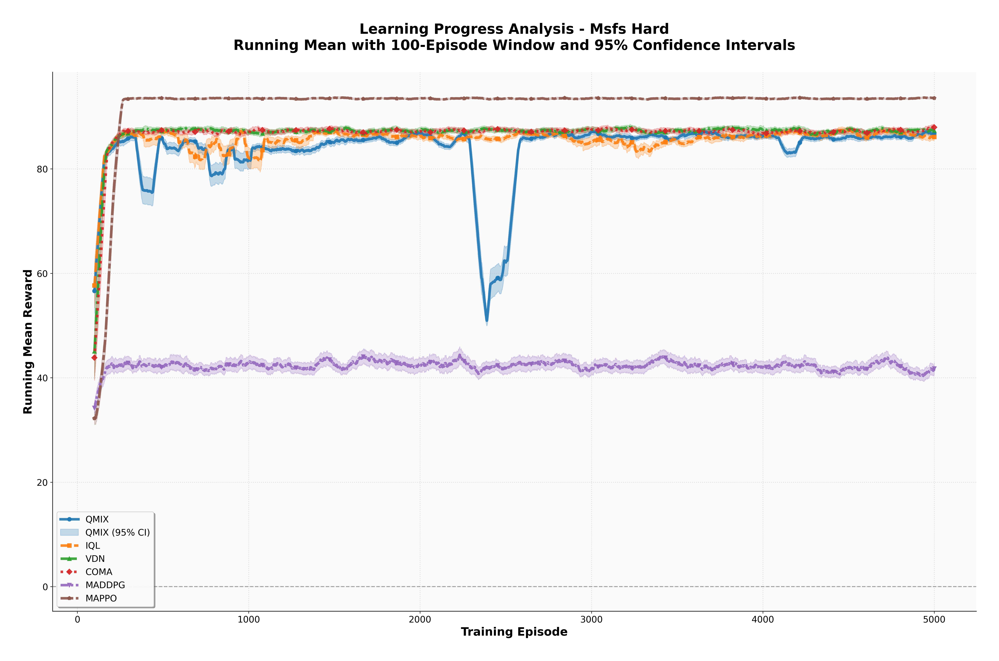
  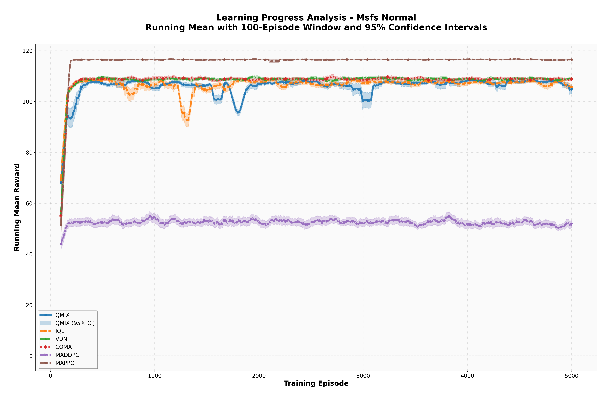
  <p><em>Figure 1: Learning curves on MSFS environments - All algorithms show clear convergence</em></p>
</div>

**Challenging Environments**:

<div align="center">
  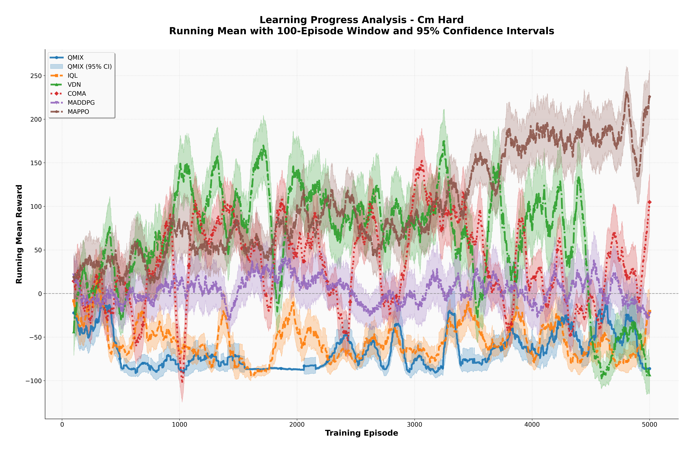
  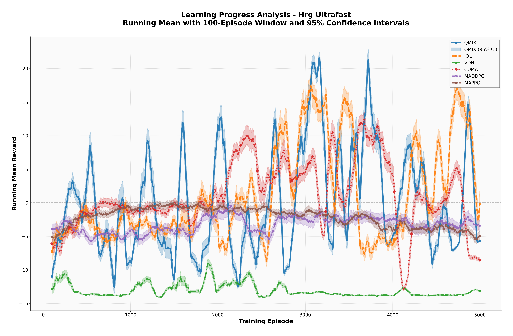
  <p><em>Figure 2: Learning curves on CM (left) and HRG (right) - More challenging environments</em></p>
</div>

**DEM Environments**:

<div align="center">
  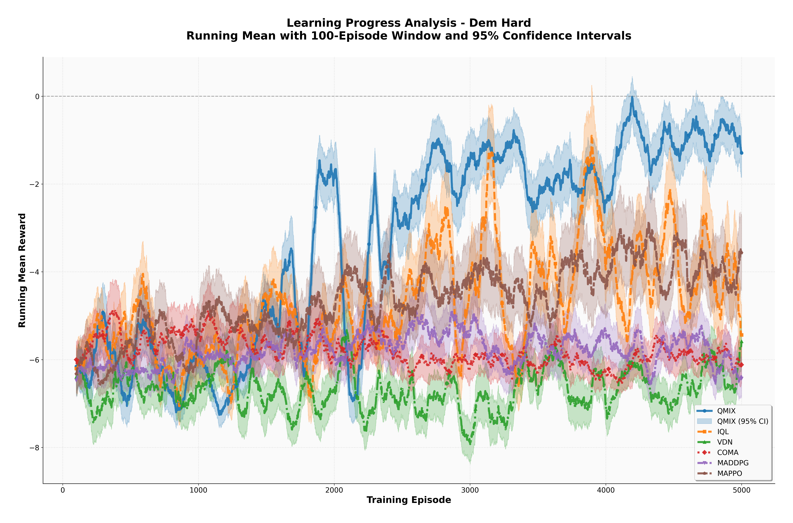
  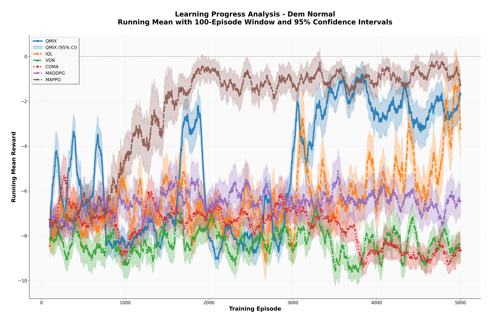
  <p><em>Figure 3: Learning curves on DEM environments - Dynamic escort mission scenarios</em></p>
</div>

**PettingZoo Environments**:

<div align="center">
  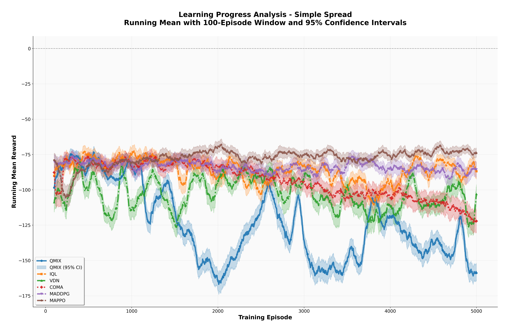
  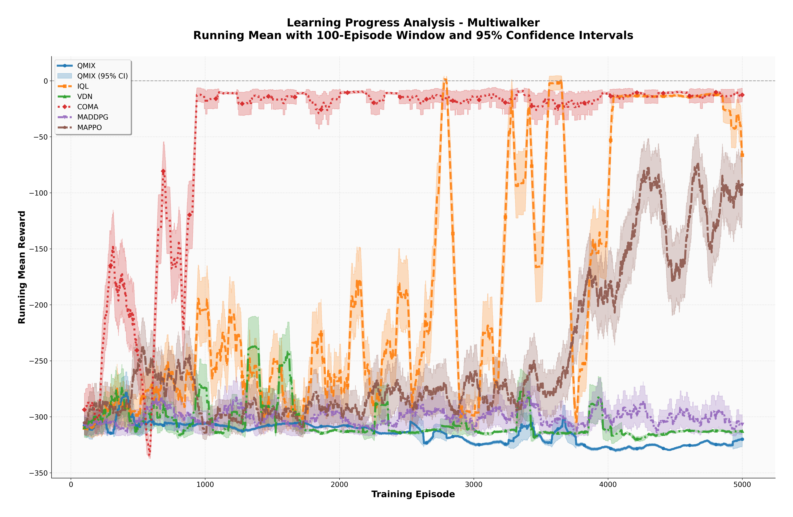
  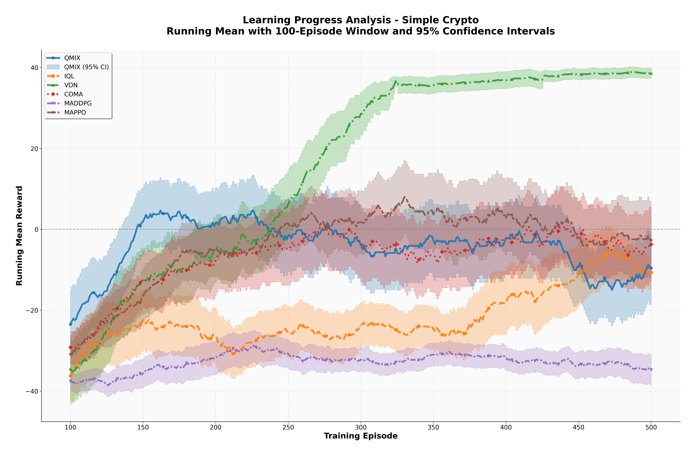
  <p><em>Figure 4: Learning curves on PettingZoo environments</em></p>
</div>

#### Performance Comparison

<div align="center">
  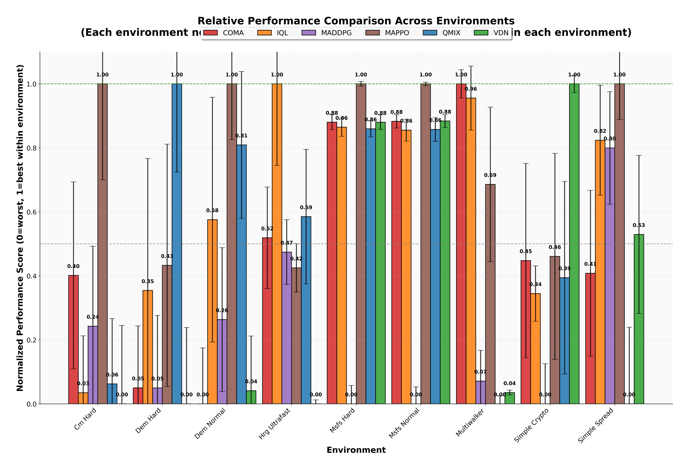
  <p><em>Figure 5: Normalized performance comparison across all environments</em></p>
</div>

<div align="center">
  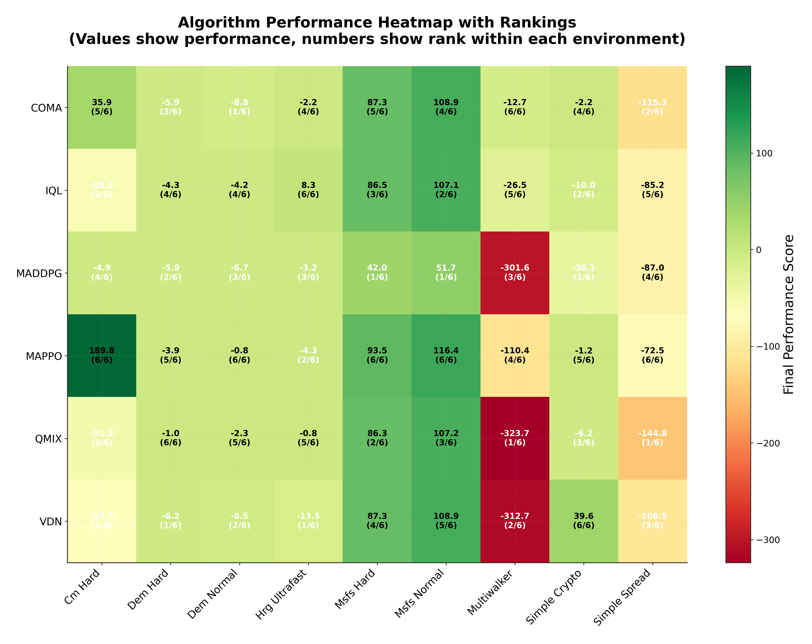
  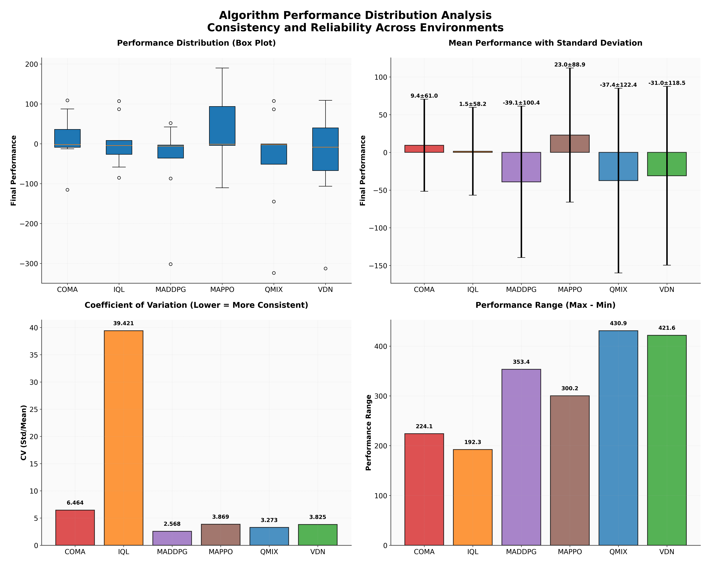
  <p><em>Figure 6: Performance heatmap (left) and distribution analysis (right)</em></p>
</div>

### Running the Analysis

```bash
cd analysis
python corrected_analyze_results.py

# View detailed results
cat corrected_output/corrected_analysis_summary.txt
cat corrected_output/corrected_detailed_metrics.json
```

For detailed metrics and visualizations, see the `analysis/corrected_output/` directory.

---

## 📚 Tutorials

Interactive Jupyter notebooks are provided:

- [CM Environment Tutorial](./Env/CM_environment_tutorial.ipynb)
- [DEM Environment Tutorial](./Env/DEM_environment_tutorial.ipynb)
- [HRG Environment Tutorial](./Env/HRG_environment_tutorial.ipynb)
- [MSFS Environment Tutorial](./Env/MSFS_environment_tutorial.ipynb)
- [SMAC Wrapper Tutorial](./Env/SMAC_Wrapper_Tutorial.ipynb)

---

## 🤝 Contributing

Contributions are welcome! Please follow these steps:

1. Fork the repository
2. Create a feature branch (`git checkout -b feature/AmazingFeature`)
3. Commit your changes (`git commit -m 'Add some AmazingFeature'`)
4. Push to the branch (`git push origin feature/AmazingFeature`)
5. Open a Pull Request

---

## 📄 License

This project is licensed under the MIT License - see the LICENSE file for details.

---

## 📧 Contact

For questions, issues, or collaborations:

- **Issues**: Open an issue on GitHub
- **Author**: sswun
- **GitHub**: https://github.com/sswun

---

## 🙏 Acknowledgments

This platform builds upon research in multi-agent reinforcement learning:

- **QMIX**: [Monotonic Value Function Factorisation for Deep Multi-Agent Reinforcement Learning](https://arxiv.org/abs/1803.11485)
- **COMA**: [Counterfactual Multi-Agent Policy Gradients](https://arxiv.org/abs/1705.08926)
- **MADDPG**: [Multi-Agent Actor-Critic for Mixed Cooperative-Competitive Environments](https://arxiv.org/abs/1706.02275)
- **MAPPO**: [The Surprising Effectiveness of PPO in Cooperative Multi-Agent Games](https://arxiv.org/abs/2103.01955)
- **SMAC**: [The StarCraft Multi-Agent Challenge](https://arxiv.org/abs/1902.04043)

---

## 📊 Citation

If you use this platform in your research, please cite:

```bibtex
@misc{marlco2024,
  title={MARLCO: Multi-Agent Reinforcement Learning Cooperation Platform},
  author={Shuwei Sun},
  year={2024},
  url={https://github.com/sswun/marlco}
}
```

---

## 🗺️ Roadmap

- [ ] Add more MARL algorithms (QTRAN, QPLEX, etc.)
- [ ] Support continuous action spaces
- [ ] Add curriculum learning
- [ ] Implement communication mechanisms
- [ ] Add more benchmark environments
- [ ] Develop web-based visualization dashboard
- [ ] Multi-GPU training support

---

**Happy Multi-Agent Learning! 🚀**
