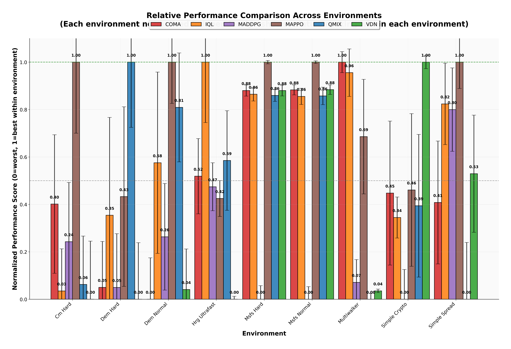
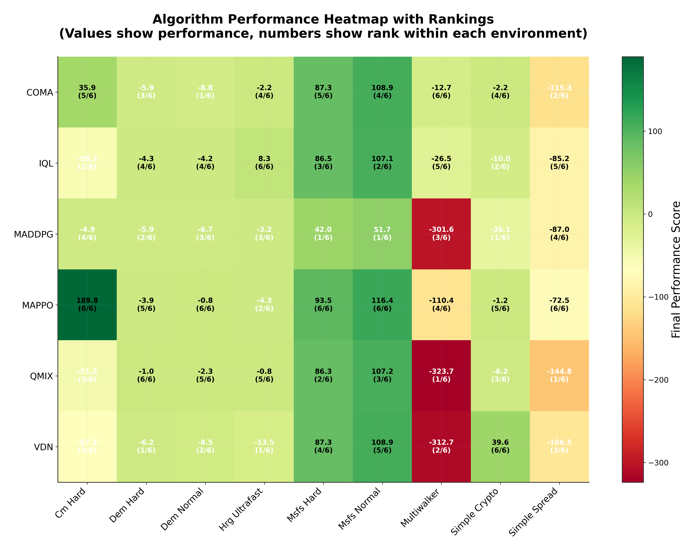
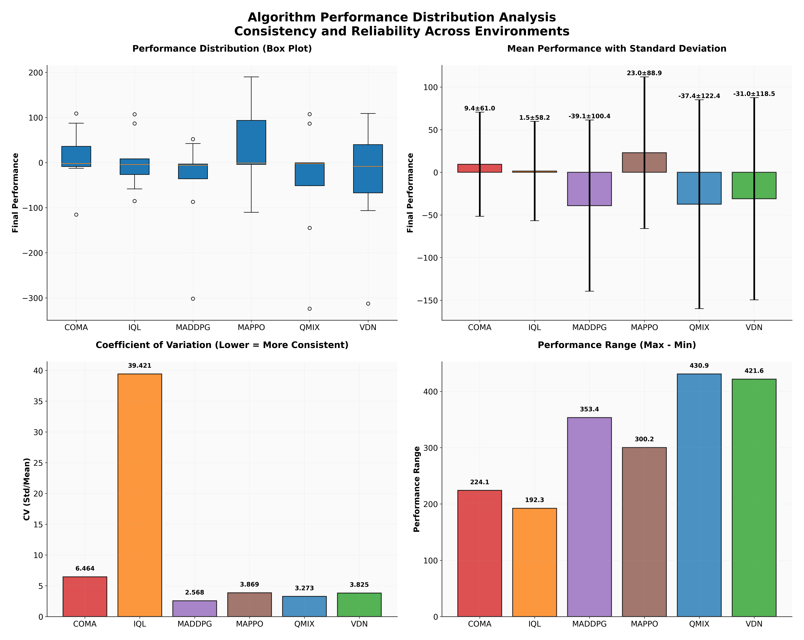

# MARLCO: 多智能体强化学习协作平台

[English](./README.md) | 中文文档


## 📌 项目概述

**MARLCO**（Multi-Agent Reinforcement Learning Cooperation，多智能体强化学习协作平台）是一个全面的多智能体强化学习实验平台，集成了多种环境和主流算法实现。本平台旨在为研究人员和从业者提供便捷的实验、算法对比和新方法开发工具。

### 核心特性

✅ **6种MARL算法**: QMIX、VDN、IQL、COMA、MADDPG、MAPPO  
✅ **5种自定义环境**: CM、DEM、HRG、MSFS、SMAC包装器  
✅ **CTDE架构**: 集中式训练分布式执行框架  
✅ **统一接口**: 所有环境和算法具有一致的API  
✅ **完善分析**: 内置结果可视化和对比分析工具  
✅ **便捷配置**: 基于YAML的配置文件快速切换实验  

---

## 📂 项目结构

```
marlco/
├── Env/                      # 多智能体环境
│   ├── CM/                   # 协作搬运环境
│   ├── DEM/                  # 动态护送任务
│   ├── HRG/                  # 异构资源采集
│   ├── MSFS/                 # 智能制造流程调度
│   └── SMAC/                 # 星际争霸多智能体挑战包装器
│
├── qmix/                     # QMIX算法实现
├── vdn/                      # VDN算法实现
├── iql/                      # IQL算法实现
├── coma/                     # COMA算法实现
├── maddpg/                   # MADDPG算法实现
├── mappo/                    # MAPPO算法实现
│
└── analysis/                 # 分析与可视化工具
    ├── data_loader.py        # 训练数据加载器
    ├── metrics_analyzer.py   # 指标分析
    └── plot_generator.py     # 图表生成
```

---

## 🚀 快速开始

### 1. 安装依赖

```bash
# 克隆仓库
git clone https://github.com/sswun/marlco.git
cd marlco

# 安装依赖
pip install -r Env/doc/requirements.txt

# 可选：安装SMAC环境
pip install -r Env/doc/requirements_with_smac.txt
```

### 2. 运行训练实验

```bash
# 在CM环境上训练QMIX（推荐：使用配置文件）
cd qmix
python main.py --config config_simple_spread.yaml --plots --plot-dir simplespreadplots

# 在DEM环境上训练MADDPG
cd maddpg
python main.py --config config_DEM_normal.yaml --plots

# 在HRG环境上训练MAPPO（推荐：使用ultra_fast节省时间）
cd mappo
python main.py --config config_HRG_ultrafast.yaml --plots
```

### 3. 分析结果

```bash
# 分析训练结果
cd analysis
python corrected_analyze_results.py

# 查看输出结果
cat corrected_output/corrected_analysis_summary.txt
```

---

## 🌍 环境介绍

### 1. **CM (Collaborative Moving，协作搬运)**

多个智能体协作将箱子推到目标位置。成功概率随协作智能体数量增加而提高。

- **智能体数量**: 2-4
- **难度等级**: debug、easy、normal、hard
- **核心挑战**: 协调与时机把握
- **备注**: ⚠️ 较难环境，需要仔细调参

### 2. **DEM (Dynamic Escort Mission，动态护送任务)**

特种部队智能体护送VIP穿越危险区域，动态形成角色（护卫、先锋、狙击手）。

- **智能体数量**: 3
- **难度等级**: easy、normal、hard
- **核心挑战**: 角色形成与威胁管理

### 3. **HRG (Heterogeneous Resource Gathering，异构资源采集)**

异构智能体（侦察兵、工人、运输者）采集资源并运回基地。

- **智能体数量**: 2-6
- **难度等级**: easy、normal、hard、ultra_fast
- **核心挑战**: 基于角色的协作
- **备注**: ⚠️ 较难环境，**推荐使用`ultra_fast`配置节省时间**

### 4. **MSFS (Smart Manufacturing Flow Scheduling，智能制造流程调度)**

机器人通过3阶段制造流程处理订单，自然形成专业化角色。

- **智能体数量**: 1-3
- **难度等级**: easy、normal、hard
- **核心挑战**: 流程优化与角色涌现
- **备注**: ✅ **基础环境，可用于检验算法是否收敛**

### 5. **SMAC (StarCraft Multi-Agent Challenge，星际争霸多智能体挑战)**

官方SMAC环境的包装器，支持多种星际争霸II战斗场景。

- **地图**: 3m、8m、2s3z、MMM、corridor等
- **核心挑战**: 战斗协调与单位控制

### 6. **PettingZoo环境**

所有算法还支持三个PettingZoo协作环境的训练：

- **multiwalker**: 多个双足行走器协作搬运包裹
- **simple_crypto**: 加密通信任务
- **simple_spread**: 地标覆盖任务

📖 **详细环境文档**: 见[Env/README_CN.md](./Env/README_CN.md)

---

## 🧠 算法介绍

### 基于价值的方法

| 算法 | 类型 | 关键特性 | 适用场景 |
|-----------|------|-------------|----------|
| **QMIX** | 价值分解 | 单调值函数混合 | 协作任务 |
| **VDN** | 价值分解 | 线性值函数分解 | 简单协调 |
| **IQL** | 独立学习 | 完全去中心化 | 基线对比 |

### 策略梯度方法

| 算法 | 类型 | 关键特性 | 适用场景 |
|-----------|------|-------------|----------|
| **COMA** | Actor-Critic | 反事实基线 | 信用分配 |
| **MADDPG** | Actor-Critic | 集中式Critic | 混合动机任务 |
| **MAPPO** | 基于PPO | 稳定训练 | 长期任务 |

📖 **详细算法文档**: 见各算法文件夹

---

## ⚙️ 配置说明

每个算法文件夹包含多个配置文件：

```yaml
# config.yaml (示例)
env:
  name: "CM"                    # 环境名称
  difficulty: "hard"            # 难度等级
  global_state_type: "concat"   # 全局状态类型

algorithm:
  gamma: 0.99                   # 折扣因子
  learning_rate: 0.001          # 学习率
  tau: 0.005                    # 目标网络更新率

training:
  total_episodes: 5000          # 总训练回合数
  batch_size: 64                # 批量大小
  buffer_size: 100              # 经验回放缓冲区大小（×1000）
  eval_interval: 100            # 评估间隔
```

**预配置文件**:
- `config_CM_hard.yaml` - CM环境（困难）
- `config_DEM_normal.yaml` - DEM环境（普通）
- `config_HRG_ultrafast.yaml` - HRG环境（超快）
- `config_MSFS_hard.yaml` - MSFS环境（困难）
- 更多...

---

## 📊 训练与评估

### 训练流程

1. **环境设置**: 使用指定难度初始化环境
2. **经验收集**: 智能体与环境交互
3. **网络更新**: 基于收集的经验更新网络
4. **评估**: 定期无探索评估性能
5. **检查点**: 保存模型和训练数据

### 监控

训练进度实时显示：

```
Episode 100/5000 | Reward: 45.23 | Epsilon: 0.25 | Loss: 0.342
Episode 200/5000 | Reward: 52.18 | Epsilon: 0.22 | Loss: 0.289
...
```

### 输出文件

- **检查点**: `checkpoints/algo_episode_*.pt`
- **训练数据**: `checkpoints/env_difficulty_training_data_*.json`
- **图表**: `plots/env_difficulty_*.png`

---

## 📈 分析工具

### 数据加载器

```python
from analysis.data_loader import TrainingDataLoader, compute_statistics

loader = TrainingDataLoader()
rewards = loader.load_algorithm_environment_data("QMIX", "CM_hard")
stats = compute_statistics(rewards)
```

### 指标分析器

- 回合奖励
- 回合长度
- 训练损失
- 探索衰减
- 性能趋势

### 图表生成器

生成出版级质量图表：
- 带置信区间的奖励曲线
- 学习曲线对比
- 性能分布
- 训练总结仪表板

---

## 🔬 基准实验

### 单算法训练

```bash
# 推荐：使用配置文件
cd qmix
python main.py --config config_simple_spread.yaml --plots

# 或指定参数
python main.py --env MSFS --difficulty hard --episodes 5000 --plots
```

### 多算法对比

```bash
# 终端1: QMIX
cd qmix
python main.py --config config_simple_spread.yaml --plots --plot-dir ../results/qmix

# 终端2: MADDPG
cd maddpg
python main.py --config config_simple_spread.yaml --plots --plot-dir ../results/maddpg

# 终端3: MAPPO
cd mappo
python main.py --config config_simple_spread.yaml --plots --plot-dir ../results/mappo
```

---

## 🛠️ 高级用法

### 自定义环境

```python
from Env.CM.env_cm_ctde import create_cm_ctde_env

# 创建自定义环境
env = create_cm_ctde_env(difficulty="custom", custom_config={
    "grid_size": 10,
    "n_agents": 4,
    "max_steps": 200
})
```

### 自定义训练循环

```python
from qmix.src.trainer import Trainer
from qmix.src.utils import load_config

config = load_config("config.yaml")
trainer = Trainer(config)
trainer.train()
```

### 超参数调优

```bash
# 调整学习率
python main.py --lr 0.0005

# 调整网络架构
python main.py --hidden-dim 512 --mixing-hidden-dim 1024

# 调整探索策略
python main.py --epsilon-start 0.5 --epsilon-end 0.05
```

---

## 📊 基准测试结果

我们提供了全面的基准测试结果，涵盖所有算法和环境。分析包括性能指标、稳定性指标和收敛分析。

### 性能总结

基于9个环境的归一化得分：

| 排名 | 算法 | 归一化得分 | 最终性能 | 训练稳定性 | 收敛速度 |
|------|-----------|------------------|-------------------|-------------------|-------------------|
| 🥇 1 | **MAPPO** | 0.778 | 22.96 ± 88.86 | 0.570 ± 0.253 | 570 回合 |
| 🥈 2 | **IQL** | 0.645 | 1.48 ± 58.22 | 0.573 ± 0.256 | 657 回合 |
| 🥉 3 | **COMA** | 0.510 | 9.44 ± 61.04 | 0.537 ± 0.311 | 766 回合 |
| 4 | **QMIX** | 0.508 | -37.39 ± 122.37 | 0.567 ± 0.319 | 357 回合 |
| 5 | **VDN** | 0.374 | -30.98 ± 118.50 | 0.698 ± 0.252 | 212 回合 |
| 6 | **MADDPG** | 0.211 | -39.08 ± 100.37 | 0.648 ± 0.254 | 179 回合 |

### 关键发现

- **最佳综合性能**: MAPPO达到最高归一化得分（0.778）
- **最稳定训练**: VDN表现出最高稳定性（0.698）
- **最快收敛**: MADDPG以最少回合数收敛（179）
- **MSFS最佳**: QMIX在MSFS_hard上达到86.27 ± 2.60

### 环境特定结果

**MSFS（收敛测试环境）**：
- ✅ 所有算法成功收敛
- QMIX: 86.27 ± 2.60（hard），107.21 ± 4.76（normal）
- 在50-135回合内收敛

**CM & HRG（挑战性环境）**：
- ⚠️ 较困难，需要更长训练时间
- 推荐HRG使用ultra_fast模式以提高效率
- 性能方差较大

**PettingZoo环境**：
- simple_spread: MAPPO和IQL表现最佳
- multiwalker: 各算法收敛一致
- simple_crypto: 方差大，需要调参

### 可视化结果

#### 各环境学习曲线

以下图表展示了所有算法在不同环境下的学习曲线（包含运行平均值和置信区间的回合奖励）：

**MSFS环境（收敛测试）**：

<div align="center">
  
  
  <p><em>图1：MSFS环境学习曲线 - 所有算法均表现出清晰的收敛趋势</em></p>
</div>

**挑战性环境**：

<div align="center">
  
  
  <p><em>图2：CM（左）和HRG（右）环境学习曲线 - 更具挑战性的环境</em></p>
</div>

**DEM环境**：

<div align="center">
  
  
  <p><em>图3：DEM环境学习曲线 - 动态护送任务场景</em></p>
</div>

**PettingZoo环境**：

<div align="center">
  
  
  
  <p><em>图4：PettingZoo环境学习曲线</em></p>
</div>

#### 性能对比

<div align="center">
  
  <p><em>图5：所有环境的归一化性能对比</em></p>
</div>

<div align="center">
  
  
  <p><em>图6：性能热力图（左）和分布分析（右）</em></p>
</div>

### 运行分析

```bash
cd analysis
python corrected_analyze_results.py

# 查看详细结果
cat corrected_output/corrected_analysis_summary.txt
cat corrected_output/corrected_detailed_metrics.json
```

详细指标和可视化结果见`analysis/corrected_output/`目录。

---

## 📚 教程

提供交互式Jupyter笔记本：

- [CM环境教程](./Env/CM_environment_tutorial.ipynb)
- [DEM环境教程](./Env/DEM_environment_tutorial.ipynb)
- [HRG环境教程](./Env/HRG_environment_tutorial.ipynb)
- [MSFS环境教程](./Env/MSFS_environment_tutorial.ipynb)
- [SMAC包装器教程](./Env/SMAC_Wrapper_Tutorial.ipynb)

---

## 🤝 贡献

欢迎贡献！请遵循以下步骤：

1. Fork 仓库
2. 创建特性分支 (`git checkout -b feature/AmazingFeature`)
3. 提交更改 (`git commit -m 'Add some AmazingFeature'`)
4. 推送到分支 (`git push origin feature/AmazingFeature`)
5. 开启Pull Request

---

## 📄 许可证

本项目采用MIT许可证 - 详见LICENSE文件。

---

## 📧 联系方式

如有问题、建议或合作意向：

- **Issues**: 在GitHub上提交issue
- **作者**: sswun
- **GitHub**: https://github.com/sswun

---

## 🙏 致谢

本平台基于多智能体强化学习领域的研究成果：

- **QMIX**: [Monotonic Value Function Factorisation for Deep Multi-Agent Reinforcement Learning](https://arxiv.org/abs/1803.11485)
- **COMA**: [Counterfactual Multi-Agent Policy Gradients](https://arxiv.org/abs/1705.08926)
- **MADDPG**: [Multi-Agent Actor-Critic for Mixed Cooperative-Competitive Environments](https://arxiv.org/abs/1706.02275)
- **MAPPO**: [The Surprising Effectiveness of PPO in Cooperative Multi-Agent Games](https://arxiv.org/abs/2103.01955)
- **SMAC**: [The StarCraft Multi-Agent Challenge](https://arxiv.org/abs/1902.04043)

---

## 📊 引用

如果您在研究中使用本平台，请引用：

```bibtex
@misc{marlco2024,
  title={MARLCO: Multi-Agent Reinforcement Learning Cooperation Platform},
  author={Shuwei Sun},
  year={2024},
  url={https://github.com/sswun/marlco}
}
```

---

## 🗺️ 路线图

- [ ] 添加更多MARL算法（QTRAN、QPLEX等）
- [ ] 支持连续动作空间
- [ ] 添加课程学习
- [ ] 实现通信机制
- [ ] 添加更多基准环境
- [ ] 开发Web可视化仪表板
- [ ] 支持多GPU训练

---

**祝您多智能体学习愉快！🚀**
